# WDProjMgFernandoFrancisco Project Proposal

# Website Name: **ORICENTRIC**
##              — The Art of Folds

## Logo

---

## Brief Description

**Oricentric** is a website developed in **HTML**, **CSS**, and **JavaScript**, aiming to **highlight the beauty of Origami**, both as a calming art and a catalyst for innovation in science. We showcase informative content on Origami’s **history**, role in modern **science** (with NASA’s starshade), and **different folds** such as valley, mountain and squash fold–all used to create different Origami works. We additionally offer a clean and user-friendly interface, and engaging visuals.

As an educational and creative website for **students**, **art enthusiasts**, **STEM, and engineering learners**, we aim to explain concepts on Origami’s history, mechanisms, and real-world applications, as well as showcasing origami as a visual form of art through our works. We hope users may learn to **appreciate** the deep cultural roots of origami, and the art of folding paper, as well as **understand** the influence of origami on technology.

---

## Outline of Pages

### **Home Page**
- Header containing the website name: **Oricentric**
- Page title: **HOME**
- Navigation bar linking to all pages:
  - History  
  - Mechanisms  
  - Exhibit  
  - NASA Application  
  - Tutorials  
  - References and Resources  
- Brief website description answering:
  - What does the website offer?  
  - What is its purpose?  
  - Who is the targeted audience?  
- Featured sections for each page, seperated in a grid-like layout; these include:
  - **History:** Images of historical papers and modern colorful creations  
  - **Exhibit:** - Images of origami pieces we made, and pictures of NASA technology using origami
  - **Mechanisms:** Visuals of different folds (mountain, valley, squash, etc.), and images of tools (adhesives, scissors)
 - **References:** - Image of people creating origami, some from the past in paitings, others from the present
- **Footer** containing:
  - Copyright  
  - Social media links  
  - Contact information  
  - Email addresses  
  - Credits to all assets used  

---

### **History**
- Header: **Oricentric: Unfolding a Colorful History**  
- Page title: **HISTORY OF ORIGAMI**  
- Navigation bar and links back to home  
- Brief introduction summarizing learning objectives  
- **Interactive timeline** organizing history into eras:
  - Early Beginnings and Invention of Origami  
  - Integration of Origami into Japanese Culture  
  - Global Influence and Origami Spreading Worldwide
  - Modern Applications inspiring Architecture and Robotics  
- Each era includes photos for visual engagement  
- Discussion of origami’s significance in Japansese culture and as an art
- Key figures and innovators
- Additional videos
- **Footer** containing:
  - Copyright  
  - Social media links  
  - Contact information  
  - Email addresses  
  - Credentials to all assets used  

---

### **Exhibit**
- Header: **Oricentric: Showcasing Numerous Masterpieces**  
- Page title: **ORIGAMI EXHIBIT**  
- Navigation bar and links back to home  
- Brief introduction to page contents  
- A **Gallery of Origami Works** by the creators:
  - Photos of finished creations  
  - Step-by-step folding procedures  
  - Short descriptions or creator notes  
- **Modern Applications** section including:
  - Engineering and architecture inspired by origami  
  - NASA’s use of origami in spacecraft and solar structures, shown with photos and videos
- **Footer** containing:
  - Copyright  
  - Social media links  
  - Contact information  
  - Email addresses  
  - Credits to all assets used  

---

### **Mechanisms**
- Header: **Oricentric: The Science Behind Every Fold**  
- Page title: **FOLDING IN ORIGAMI**  
- Navigation bar and links back to home  
- Brief explanation on why understanding folding mechanisms matters  
- **Segment on Commonly Used Folds**, including:
  - Valley, Mountain, Squash, Reverse, Pleats, and Sink folds  
- Discussion of **materials and tools**, including:
  - Paper types (Kami, Tant, Washi, etc.)  
  - Adhesives (tape, glue)  
  - Scissors, pens/pencils, tweezers  
- Additional videos or pictures demonstrating folds and materials  
- **Footer** containing:
  - Copyright  
  - Social media links  
  - Contact information  
  - Email addresses  
  - Credits to all assets used  

---

### **References / Resources**
- Header: **Sources Used**  
- Navigation bar and links back to home  
- Compiled list of all **citations, images, and videos**, organized by page  
- All references follow APA 7th Edition format  
- **Footer** containing:
  - Copyright  
  - Social media links  
  - Contact information  
  - Email addresses  

---

## Use of JavaScript
- In the **Exhibit Page**, users can navigate through folding steps:
  - `←` and `→` : Move between steps  
  - `↑` and `↓` : Scroll vertically through the page  
- **Dynamic Theme Switching**
  - Based on the time of day (Morning, Afternoon, Evening, Midnight), the CSS theme changes automatically to its respective theme.
  - The user can also toggle the theme manually as well, with JavaScript remembering the user's preferred theme if ever they leave the website
  - Shortcut: `Shift + T`
- **Music Controls**
  - A selected playlist of soundtracks can be played by the user
  - Music starts muted by default, unless previously enabled  
  - `Shift + P` : Play or Pause music  
  - `Shift + U` : Mute or Unmute music  
- **Keyboard Shortcuts**
  - The user has access to several shortcuts to pages, visual and music options, including:
  - `Shift + H` — History Page  
  - `Shift + E` — Exhibit Page  
  - `Shift + M` — Mechanisms Page  
  - `Shift + R` — References Page  
  - `Shift + T` — Toggle Theme  
  - `Shift + P` — Play/Pause Music  
  - `Shift + U` — Mute/Unmute Music  

---
### Wireframe

## HOME - top
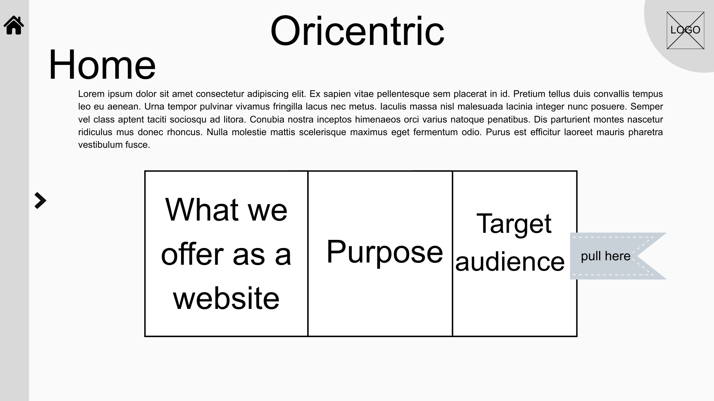

## HOME with Navigation tab expanded
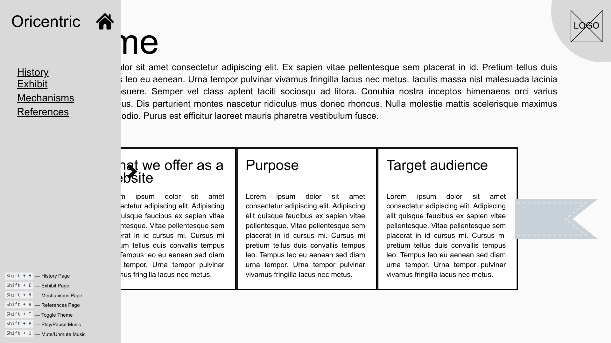

## HOME - bottom
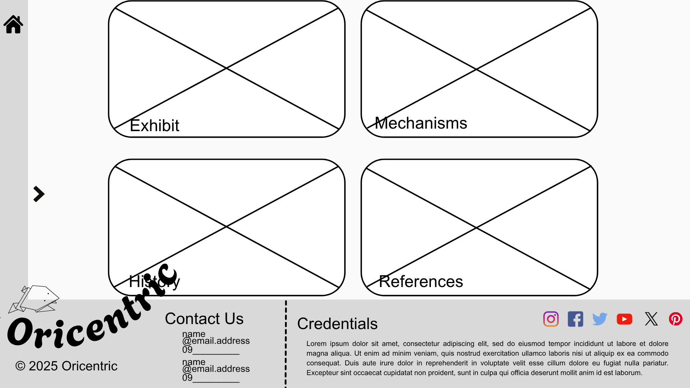

## HISTORY OF ORIGAMI - top
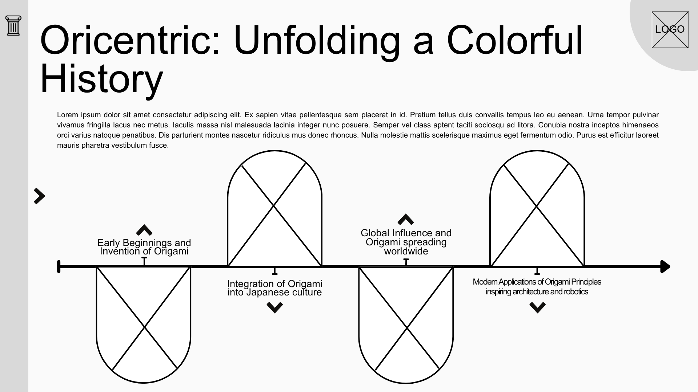

## HISTORY OF ORIGAMI - middle
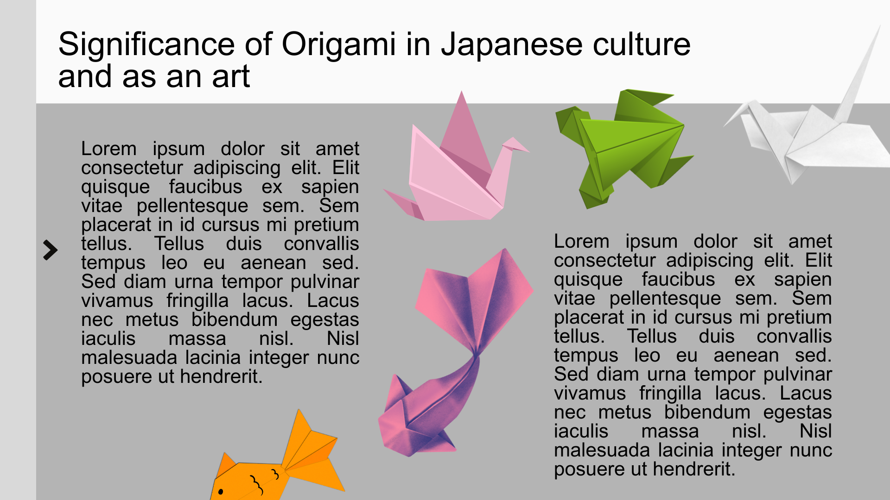

## HISTORY OF ORIGAMI - bottom
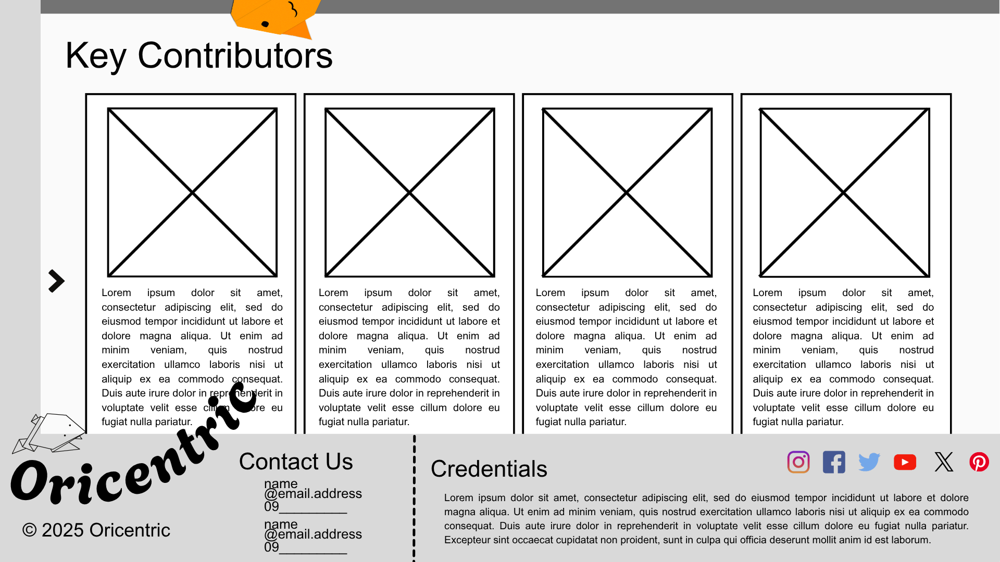

## ORIGAMI EXHIBIT - top
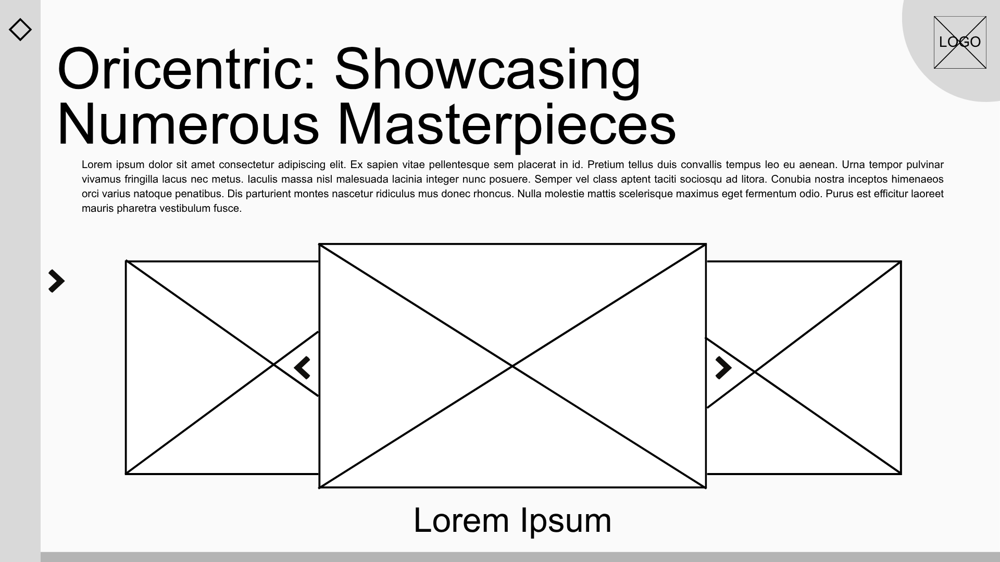

## ORIGAMI EXHIBIT - per origami
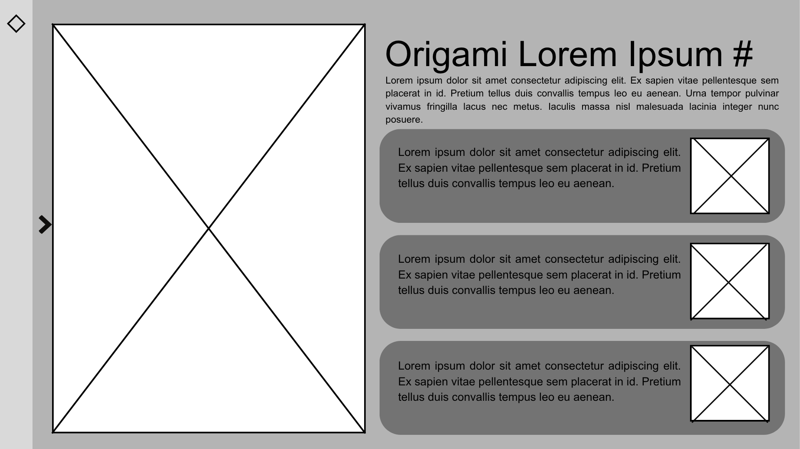

## ORIGAMI EXHIBIT - bottom
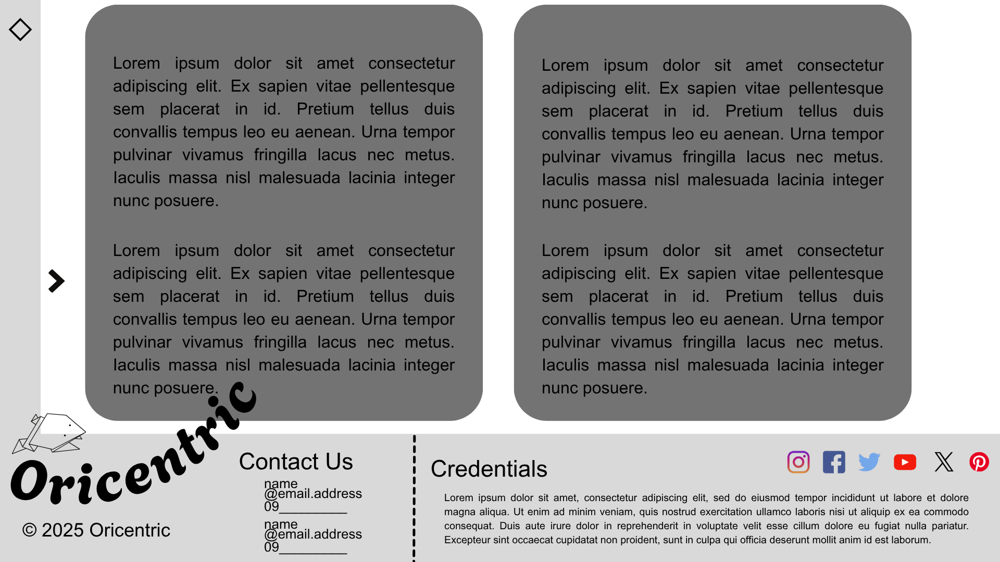

## FOLDING IN ORIGAMI - top
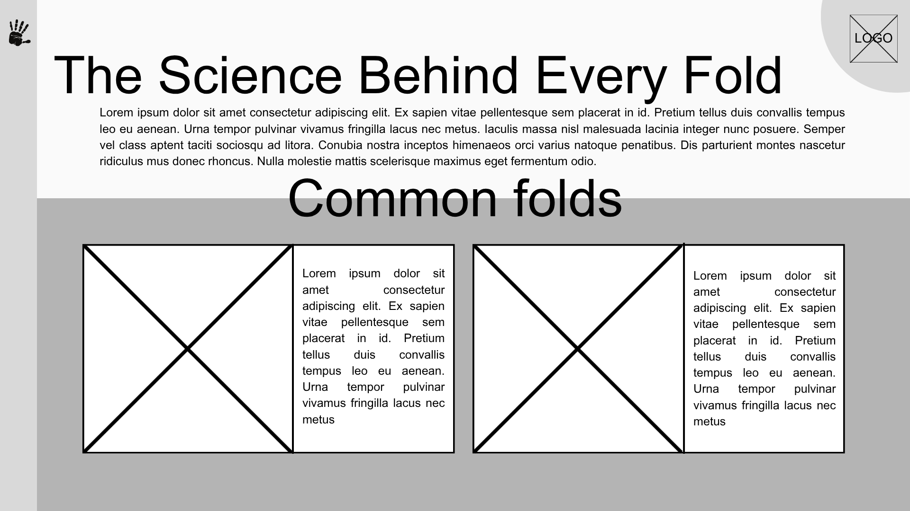

## FOLDING IN ORIGAMI - bottom
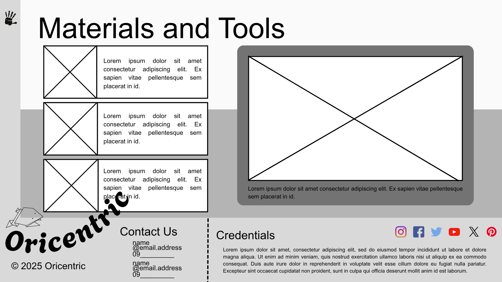

## REFERENCES & RESOURCES
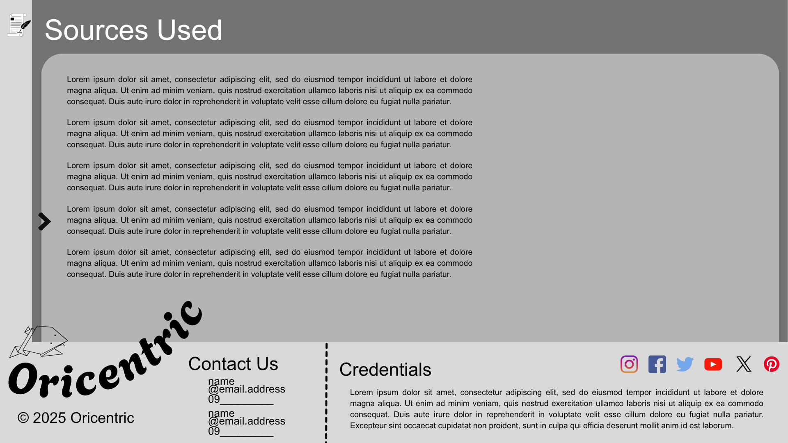

---